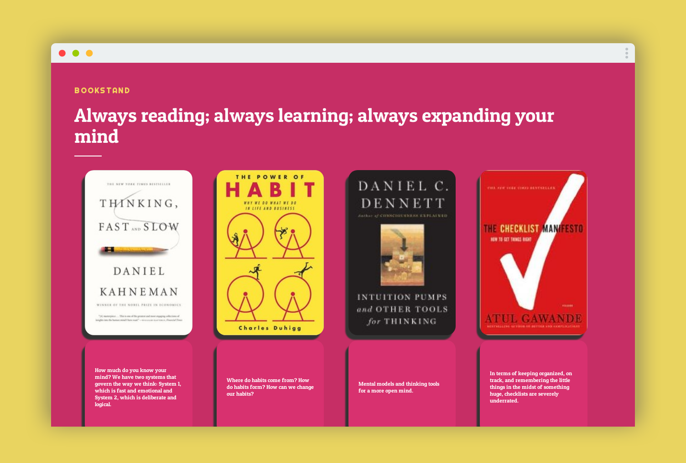

# Bookstand

A virtual bookshelf created to represent my never-ending stack of books.

Screenshot taken by [Screen Guru](https://screen.guru)

## Why I Created This

I wanted to learn frontend development and also wanted to be able to share with the world my bookshelf. Sure, I could have used something like Goodreads but where's the fun in that?

I want to add more and more functionality to it over time, which I will list below.

## How to Use

### Running the frontend

`
cd frontend
`

`
npm i
`

`
yarn start
`
or
`
npm run start
`

### Accesing the API

- https://limitless-journey.herokuapp.com/books

## Technologies Used

- [Create React App](https://github.com/facebook/create-react-app) 
- [Strapi](https://strapi.io/) for API creation. I can't say enough great things about this. What would have taken much longer to do from scratch, took me a couple of minutes.
- [GraphQL](https://graphql.org/) as the Query Language for the API
- [Emotion](https://emotion.sh/) for styling even though I still do not like the CSS-in-JS solutions. My preferred option is [Sass](https://sass-lang.com/).
- [MongoDB](https://www.mongodb.com/). Not my preferred option for a database but I just wanted something up and running and Strapi works seamlessly with Mongo. I will switch over to [PostgreSQL](https://www.postgresql.org/) in the near future.
- [Heroku](https://www.heroku.com/) for hosting the API.
- [MLab](https://mlab.com/) for hosting the MongoDB database.
- [Surge](https://surge.sh/) for hosting the React App. Considering switching over to [Firebase](https://firebase.google.com/) since my other sites are hosted on there.
- [S3](https://aws.amazon.com/s3/) is used as a provider to persist the book images. I quickly learned that uploading directly to Heroku would cause the images to "disappear" after about a day. Each day, the dynos self restart (also called: Cycling). See Heroku's post for more detail: [Why are my file uploads missing/deleted?](https://help.heroku.com/K1PPS2WM/why-are-my-file-uploads-missing-deleted).

## Currently Working On

- [ ] Adding more books (I have about 400+ books in my at home library so you see why I need to add the filter functionality below quite soon)
- [ ] Add more options to the metadata for the API such as genre and multiple author arrays
- [ ] Adding filters based on general topic/genre
- [ ] Tutorial on how I built it
- [ ] Switching to PostgreSQL database
- [ ] Dockerizing

## Future Features

- [ ] Search functionality
- [ ] Intro sentence cycles through quotes
- [ ] More intuitive design
- [ ] Porting over to something like [Gatsby](https://www.gatsbyjs.org/) or [Next](https://nextjs.org/) for "blog like" functionality
- [ ] Click on the book for review
- [ ] Kubernetes hosting
- [ ] Update on my progress through the book
- [ ] Possibly: Gatsby starter

## Finished

- [x] Mobile friendly (hopefully). Tested on Chrome, Safari, Brave, and Firefox on iOS. Friends tested it on Chrome on Android.
